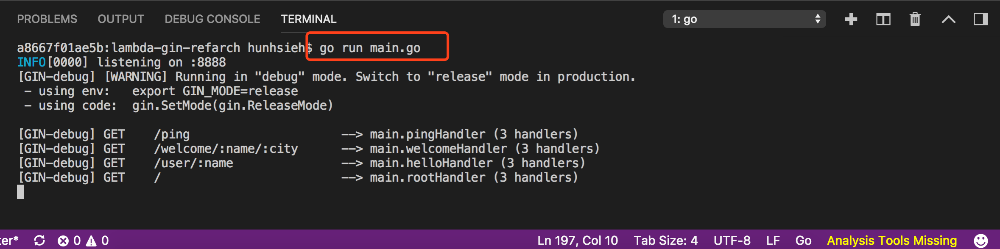
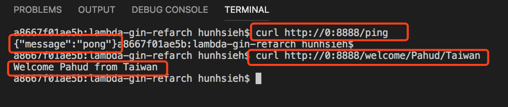
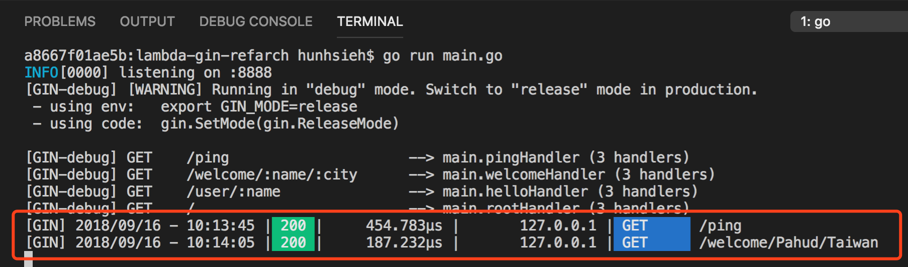

[](https://travis-ci.org/pahud/lambda-gin-refarch)
[](https://goreportcard.com/report/github.com/pahud/lambda-gin-refarch)

# lambda-gin-refarch

**lambda-gin-refarch** is a reference architecture for AWS Lambda with Golang([Gin HTTP Framework](https://github.com/gin-gonic/gin)), Amazon API Gateway and [AWS SAM](https://docs.aws.amazon.com/lambda/latest/dg/serverless_app.html) deployment.


## Features 
- develop, test and debug locally with your favirote IDE like VSCode
- run locally or in AWS Lambda and Amazon API Gateway with the same source code.
- single `make world` to build, zip, package and deploy to AWS Lambda and Amazon API Gateway with no hassle.


## Setup

Just git clone the repository into your `GOROOT/src`. For example, if your `GOROOT` is `~/go` , just check out to `~/go/src/lambda-gin-refarch` like this

```sh
$ cd $GOROOT/src
$ git clone https://github.com/pahud/lambda-gin-refarch.git
```


[Install](https://github.com/golang/dep) `dep` binary and `dep ensure` to install the required go modules

```sh
$ cd lambda-gin-refarch
$ dep ensure -v
```


OK you are ready to test or deploy now!


## Local test

In your favorite IDE like VSCode, type `go run main.go` to bring it up listening on `localhost:8888`




And you can test it directly on `http://0:8888/`




Of course, you will see the Gin access log in the terminal.




## Deploy to AWS Lambda and Amazon API Gateway

Edit `Makefile`  and update the following variables

```
S3TMPBUCKET	?= pahud-tmp
STACKNAME	?= lambda-gin-refarch
LAMBDA_REGION ?= us-west-2
```

- **S3TMPBUCKET** - change this to your private S3 bucket and make sure you have read/write access to it. This is an intermediate S3 bucket for AWS SAM CLI to deploy as a staging bucket.
- **STACKNAME** - change this to your favorite cloudformatoin stack name.
- **LAMBDA_REGION** - the region ID you are deploying to


When you complete, Just run `make world` and you will see the `go build`, `zip` the compiled binary `main` into `main.zip` and `sam deploy` to deploy your `main.zip` bundle AWS Lambda and provision API Gateway together.

```bash
$ make world
```
Output
```
Checking dependencies...
Building...
Packing binary...
updating: main (deflated 65%)

        SAM CLI now collects telemetry to better understand customer needs.

        You can OPT OUT and disable telemetry collection by setting the
        environment variable SAM_CLI_TELEMETRY=0 in your shell.
        Thanks for your help!

        Learn More: https://docs.aws.amazon.com/serverless-application-model/latest/developerguide/serverless-sam-telemetry.html


        Deploying with following values
        ===============================
        Stack name                 : lambda-gin-refarch
        Region                     : None
        Confirm changeset          : False
        Deployment s3 bucket       : pahud-tmp
        Capabilities               : ["CAPABILITY_IAM"]
        Parameter overrides        : {}

Initiating deployment
=====================
Uploading to 229eee6e0deca8e343c1c8548c7bc968  4061671 / 4061671.0  (100.00%)
Uploading to bd6a009417ef9ae6a9cbede486960e57.template  716 / 716.0  (100.00%)
Waiting for changeset to be created..

CloudFormation stack changeset
------------------------------------------------------------------------------------------------
Operation                        LogicalResourceId                ResourceType                   
------------------------------------------------------------------------------------------------
* Modify                         SampleFunction                   AWS::Lambda::Function          
* Modify                         ServerlessRestApi                AWS::ApiGateway::RestApi       
------------------------------------------------------------------------------------------------

Changeset created successfully. arn:aws:cloudformation:us-west-2:112233445566:changeSet/samcli-deploy1582098819/a4812da7-2045-4b80-b891-6c1c63f75f0c


2020-02-19 07:53:46 - Waiting for stack create/update to complete

CloudFormation events from changeset
-------------------------------------------------------------------------------------------------
ResourceStatus           ResourceType             LogicalResourceId        ResourceStatusReason   
-------------------------------------------------------------------------------------------------
UPDATE_IN_PROGRESS       AWS::Lambda::Function    SampleFunction           -                      
UPDATE_COMPLETE          AWS::Lambda::Function    SampleFunction           -                      
UPDATE_COMPLETE          AWS::CloudFormation::S   lambda-gin-refarch       -                      
                         tack                                                                     
UPDATE_COMPLETE_CLEANU   AWS::CloudFormation::S   lambda-gin-refarch       -                      
P_IN_PROGRESS            tack                                                                     
-------------------------------------------------------------------------------------------------

Stack lambda-gin-refarch outputs:
-------------------------------------------------------------------------------------------------
OutputKey-Description                            OutputValue                                    
-------------------------------------------------------------------------------------------------
DemoGinApi - URL for application                 https://zkkzpf9vr2.execute-api.us-             
                                                 west-2.amazonaws.com/Prod/ping                 
-------------------------------------------------------------------------------------------------

Successfully created/updated stack - lambda-gin-refarch in us-west-2


# print the cloudformation stack outputs
aws --region us-west-2 cloudformation describe-stacks --stack-name "lambda-gin-refarch" --query 'Stacks[0].Outputs'
[
    {
        "OutputKey": "DemoGinApi",
        "OutputValue": "https://zkkzpf9vr2.execute-api.us-west-2.amazonaws.com/Prod/ping",
        "Description": "URL for application",
        "ExportName": "DemoGinApi"
    }
]
[OK] Layer version deployed.
```


## Get your API Gateway URL

You will see the API Gateway URL in the `OutputValue` above.


Try request the URL with cURL or http browser:

```bash
curl -s  https://zkkzpf9vr2.execute-api.us-west-2.amazonaws.com/Prod/ping | jq -r                                                  
{
  "message": "pong"
}
```


## Clean up

Now you have a simple **Gin HTTP Service in Golang** which can be deployed locally and in AWS Serverless with exactly the same source code. Golang has extremely excellent performanc for AWS Lambda especially when your Lambda container being reused. Check your cloudwatch log for the `/ping` request, the duration could be less than `1ms` when you reuse the pre-warmed lambda container (check [this tweet](https://twitter.com/pahudnet/status/1038817717581570049)).


To clean up the serverless environment you deployed on AWS, just delete the cloudformaton stack. You may optionally manually remove everyting under the intermediate S3 bucket if you like.


