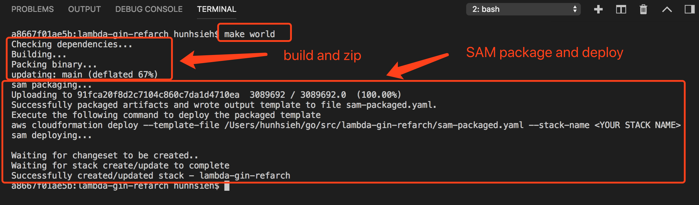
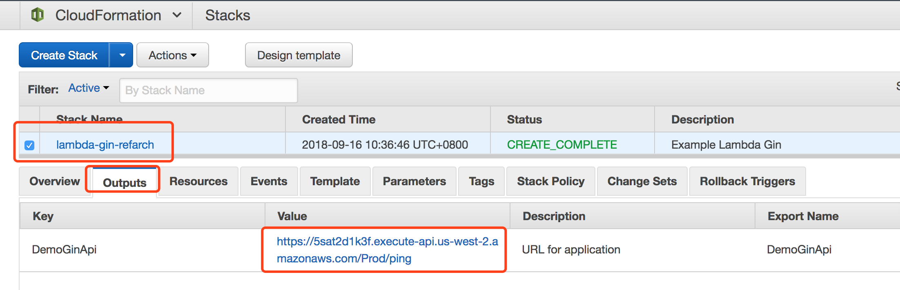
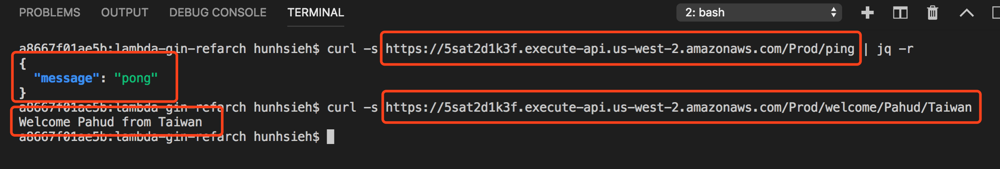

# lambda-gin-refarch

**lambda-gin-refarch** is a reference architecture for AWS Lambda with Golang([Gin HTTP Framework](https://github.com/gin-gonic/gin)), Amazon API Gateway and [AWS SAM](https://docs.aws.amazon.com/lambda/latest/dg/serverless_app.html) deployment.


## Features 
- develop, test and debug locally with your favirote IDE like VSCode
- run locally or in AWS Lambda and Amazon API Gateway with the same source code.
- single `make world` to build, zip, package and deploy to AWS Lambda and Amazon API Gateway with no hassle.


## Setup

Just git clone the repository into your `GOROOT/src`. For example, if your `GOROOT` is `~/go` , just check out to `~/go/src/lambda-gin-refarch` like this

```sh
$ cd $GOROOT/src
$ git clone https://github.com/pahud/lambda-gin-refarch.git
```


[Install](https://github.com/golang/dep) `dep` binary and `dep ensure` to install the required go modules

```sh
$ cd lambda-gin-refarch
$ dep ensure -v
```


OK you are ready to test or deploy now!


## Local test

In your favorite IDE like VSCode, type `go run main.go` to bring it up listening on `localhost:8888`


And you can test it directly on `http://0:8888/`


Of course, you will see the Gin access log in the terminal.


## Deploy to AWS Lambda and Amazon API Gateway

Edit `Makefile`  and update 2 variables below

```
S3TMPBUCKET	?= pahud-tmp
STACKNAME	?= lambda-gin-refarch
```

- **S3TMPBUCKET** - change this to your private S3 bucket and make sure you have read/write access to it. This is an intermediate S3 bucket for AWS SAM package and deploy.
- **STACKNAME** - change this to your favorite cloudformatoin stack name.


When you complete, Just type `make world` and you will see the `go build`, `zip` the compiled binary `main` into `main.zip` ,`aws cloudformation package` to package your Lambda bundle and eventually `aws cloudformation deploy` to deploy your serverless applicationto AWS.





## Get your API Gateway URL

Go to cloudformation console, check your **StackName** and click the **Outputs** tab. The value is your API URL.




Try request the URL with cURL or http browser:




## Clean up

Now you have a simple **Gin HTTP Service in Golang** which can be deployed locally and in AWS Serverless with exactly the same source code. Golang has extremely excellent performanc for AWS Lambda especially when your Lambda container being reused. Check your cloudwatch log for the `/ping` request, the duration could be less than `1ms` when you reuse the pre-warmed lambda container (check [this tweet](https://twitter.com/pahudnet/status/1038817717581570049)).


To clean up the serverless environment you deployed on AWS, just delete the cloudformaton stack. You may optionally manually remove everyting under the intermediate S3 bucket if you like.


